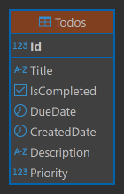

# My Todo App

「React + .NET + Docker を用いて、個人でフルスタック開発・デプロイ・運用まで一貫して行った実証アプリです。」

### アプリ概要

<aside>
このアプリはReactとC# ASP.netでフルスタックで構築しています。DBはsupabaseでPostgreSQLを使用してデータの永続化実施、Docker環境での開発の標準化、デプロイはRenderを利用しています。</aside>

<aside>
タスクの作成・編集・削除、完了・未完了切り替え、ページング処理を実装済みです。ログイン認証は今後開発予定です。CRUDの基本的な動作ですがフルスタックで開発しています。
</aside>

<aside>
今後の働き方の希望として基本リモート環境を希望しています。分野としてはこれまで携わってきたWeb開発を希望しています。
</aside>

### デモ
- **アプリURL** [https://my-todo-frontend.onrender.com/](https://my-todo-frontend.onrender.com/)
(Renderの無料枠が期限切れのためDBをsupabase変更しましたが不具合発生中です。)
- **リポジトリ** [https://github.com/mk1-pixel/my-todo-app](https://github.com/mk1-pixel/my-todo-app)

### 技術スタック
- フロントエンド: [React, Axios, ReactRouter, Tailwind CSS]
- バックエンド: [C#, .ASP.NETCore, EntityFrameworkCore]
- DB: [PostgresQL]
- インフラ: [Docker, Render, supabase]
- その他: [Git, Postman]

### デプロイについて
このアプリはRenderのフリープランを利用しています。そのためコンテナがスリープ状態になる事があり、アクセス時に遅延が発生することがあります。その場合は最大50秒程待ってコンテナが起動してからブラウザ更新をしてください。（現在不具合発生中です）

### セットアップ（ローカル環境で動かす場合）
1. リポジトリのクローン: `git clone https://github.com/mk1-pixel/my-todo-app.git`
2. .env.localの作成: /frontend/.env.localを作成。
    - 内容は `VITE_API_BASE_URL=http://localhost:5000/api/todo/`
3. Doker環境の起動: `docker-compose -f compose.dev.yml up --build`

### 経過概要
- 1週間目：Reactの学習期間、UdemyやYouTube、公式チュートリアルなどを実施しました。始めはよくわかりませんでしたが学習を続ける事で概要はつかめたと思います。
- 2週間目：実際にフロントエンドからアプリ作成を開始しました。まずReactだけで動くものを作り、その後.netでApiを作成してフロント側と繋げました。DB利用でデータの永続化して、形になった所でDocker環境に移行しています。
- 3週間：Renderにデプロイ後、詳細ページを作成中。
- 4週間目：ページング処理、詳細ページ等を実装しました。
- 今後の予定
    - ログイン認証などの実装
    - コードリファクタリング
    - CI/CD環境に移行（実施済）
    - テスト実装など
    - TypeScript対応

### アーキテクチャ図

### ER図

### API一覧
|Method|URL|説明|
|------|---|----|
|GET|./api/todo|タスク一覧の取得|
|GET|./api/todo/:id|タスクの取得|
|POST|./api/todo|タスク追加|
|PUT|./api/todo/:id|タスク編集|
|DELETE|./api/todo/:id|タスク削除|

### 機能一覧

- タスク一覧表示
- タスクの追加、編集、削除
- タスクの完了／未完了の変更
- 未完了から完了へ戻す機能
- 詳細ページの追加、詳細データの追加、編集、削除
- ローディング処理
- ページング処理
- 一覧のソート機能

### 課題と工夫点
- フルスタックで開発出来る事の証明：今回はこの環境で開発出来る事を示すために作成。そのためアプリ自体は簡単なものにした。
- 開発環境の標準化：Dockerでフロントエンド、バックエンド、DBをコンテナ化し、リモート開発での標準化を実施。また、環境構築の煩雑さをDocker Composeを導入し1コマンドで解決。
- デプロイ：フロントエンドとバックエンドはRenderでデプロイし、DBはsupabaseに変更。基本的なCI/CDの構築をGitHub Actionsで実施。今後はテストやTypeScriptにも対応予定。

### ワイヤーフレーム
（初期バージョン）
[https://www.figma.com/design/zRkEX2gLczejwM6HuGLeCC/TODO%E3%82%A2%E3%83%97%E3%83%AA?node-id=0-1&t=sZFi5v20zDKiCCaI-1](https://www.figma.com/design/zRkEX2gLczejwM6HuGLeCC/TODO%E3%82%A2%E3%83%97%E3%83%AA?node-id=0-1&t=sZFi5v20zDKiCCaI-1)

### 要件

| 項目 | 内容 |
| --- | --- |
| フロントエンド | React 18 + Tailwind CSS |
| バックエンド | ASP.NET Core Web API（C#） |
| データベース | PostgreSQL |
| デプロイ | Render supabase |
| バージョン管理 | Git + GitHub |
| コンテナ管理 | Dockerを使用してフロントエンド・バックエンド・DBをコンテナ化 |
| Docker構成 | docker-composeによりローカル環境で一括起動可能 |
| CI/CD | GitHub Actionsを用いてビルド・デプロイ |
| テスト実行（予定） | PR作成時にCIで自動テストを実行するワークフローを組む |